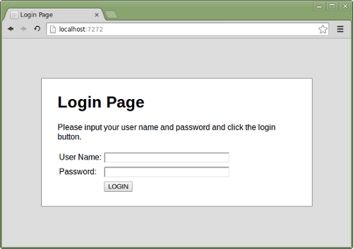

=====================================================
Web testing with Robot Framework and Selenium2Library
=====================================================

`Robot Framework`_ is a generic open source test automation framework and
`Selenium2Library`_ is one of the many test libraries that can be used with
it. In addition to showing how they can be used together for web testing,
this demo introduces the basic Robot Framework test data syntax, how tests
are executed, and how logs and reports look like.

See also `Robot Framework Demo`_ and
`Acceptance Test Driven Development with Robot Framework`_ projects.

.. contents:: **Contents:**
   :depth: 1
   :local:

Downloading demo package
========================

To get the demo, you can either download and extract the latest
*WebDemo-<date>.zip* package from the `download page`_ or checkout the
`source code`_ directly. As a result you get *WebDemo* directory with
*demoapp* and *login_tests* sub directories.

Example `test cases`_ and `generated results`_ are available also online.
There is thus no need to get the demo if are not interested in `running it`__
yourself.

__ `running demo`_

Demo application
================

The demo application is a very simple login page shown below. With
user name *demo* and password *mode* you get into a welcome page, and
otherwise you end up to an error page. How to start and stop the
application yourself is explained in `Starting demo application`_
section.

Test cases
==========

Test case files and a resource file used by them are located in *login_test*
directory. Click file names below to see the latest versions online.

`valid_login.txt`_
    A test suite with a single test for valid login.

    This test has a workflow that is created using keywords in
    the imported resource file.

`invalid_login.txt`_
    A test suite containing tests related to invalid login.

    These tests are data-driven by their nature. They use a single
    keyword, specified with Test Template setting, that is called
    with different arguments to cover different scenarios.

    This suite also demonstrates using setups and teardowns in
    different levels.

`gherkin_login.txt`_
    A test suite with a single Gherkin style test.

    This test is functionally identical to the example in
    valid_login.txt file.

`resource.txt`_
    A resource file with reusable keywords and variables.

    The system specific keywords created here form our own
    domain specific language. They utilize keywords provided
    by the imported Selenium2Library.

Generated results
=================

After `running tests`_ you will get report and log in HTML format. Example
files are also visible online in case you are not interested in running
the demo yourself:

- `report.html`_
- `log.html`_

Running demo
============

Preconditions
-------------

A precondition for running the tests is having `Robot Framework`_ and
`Selenium2Library`_ installed, and they in turn require
Python_. Robot Framework `installation instructions`__ cover both
Robot and Python installations, and Selenium2Library has its own
`installation instructions`__.

In practice it is easiest to install Robot Framework and
Selenium2Library along with its dependencies using `pip`_ package
manager. Once you have pip installed, all you need to do is running
these commands::

    pip install robotframework
    pip install robotframework-selenium2library

__ http://code.google.com/p/robotframework/wiki/Installation
__ https://github.com/rtomac/robotframework-selenium2library/blob/master/INSTALL.rst

Starting demo application
-------------------------

Running tests requires the `demo application`_ located under *demoapp*
directory to be running.  It can be started either by double clicking
*demoapp/server.py* file in a file manager or by executing it from the
command line::

    python demoapp/server.py

After the demo application is started, it is be available in URL
http://localhost:7272. You can test it manually, valid credentials are
*demo/mode*, and it needs to be running while executing the automated
tests.

If the application was started by double-clicking *demoapp/server.py*
file, it can be shut down by closing the opened window. If it was
executed from the command line, using *Ctrl-C* is enough.

Running tests
-------------

The `test cases`_ are located in *login_tests* directory. To execute
them all use::

    pybot login_tests

You can also run an individual test case file and use various command line
options supported by Robot Framework::

    pybot login_tests/valid_login.txt
    pybot --test InvalidUserName --loglevel DEBUG login_tests

Run *pybot --help* for more information about the command line usage.

Using different browsers
------------------------

The browser that is used is controlled by *${BROWSER}* variable defined in
`resource.txt`_ resource file. Firefox browser is used by default, but that
can be easily overridden from the command line::

    pybot --variable BROWSER:Chrome login_tests
    pybot --variable BROWSER:IE login_tests

Consult Selenium2Library_ documentation about supported browsers. Notice also
that some browsers, most notable Chrome__ and `Internet Explorer`__, require
separate drivers to be installed before they can be used.

__ http://code.google.com/p/selenium/wiki/ChromeDriver
__ http://code.google.com/p/selenium/wiki/InternetExplorerDriver

.. _Robot Framework: http://robotframework.org
.. _Selenium2Library: https://github.com/rtomac/robotframework-selenium2library
.. _Robot Framework Demo: https://bitbucket.org/robotframework/robotdemo/wiki/Home
.. _Acceptance Test Driven Development with Robot Framework: https://code.google.com/p/atdd-with-robot-framework/
.. _Python: http://python.org
.. _pip: http://pip-installer.org
.. _download page: https://bitbucket.org/robotframework/webdemo/downloads
.. _source code: https://bitbucket.org/robotframework/webdemo/src
.. _valid_login.txt: https://bitbucket.org/robotframework/webdemo/src/master/login_tests/valid_login.txt
.. _invalid_login.txt: https://bitbucket.org/robotframework/webdemo/src/master/login_tests/invalid_login.txt
.. _gherkin_login.txt: https://bitbucket.org/robotframework/webdemo/src/master/login_tests/gherkin_login.txt
.. _resource.txt: https://bitbucket.org/robotframework/webdemo/src/master/login_tests/resource.txt
.. _report.html: report.html
.. _log.html: log.html
